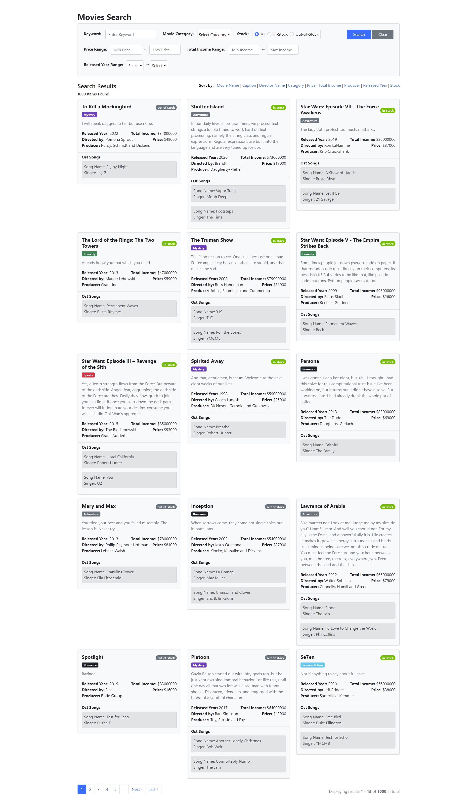

<div>
  
  # Search with Ransack Gem
  
  [](https://www.ruby-lang.org/en/news/2019/12/25/ruby-2-7-0-released) 
  [](https://rubygems.org/gems/rails/versions/7.0.4)
  [](https://rubygems.org/gems/faker/versions/2.23.0)
  [](https://rubygems.org/gems/ransack/versions/3.2.1)
  [](https://rubygems.org/gems/ransack/kaminari/1.2.2)

</div>

A movie searching and sorting results project by multiple fields using Ransack Gem.

## Prerequisites

This project setup steps expect following tools installed on the system.

- Ruby [2.7.0](https://www.ruby-lang.org/en/news/2019/12/25/ruby-2-7-0-released)
- Rails [7.0.4](https://rubygems.org/gems/rails/versions/7.0.4)

## Installation

### Check your ruby version

```ruby
  ruby -v
``` 
The ouput should start with something like ruby 2.7.0

If not, install the right ruby version using ruby version management tools.

> #### Install using rvm
  Run the following command to install ruby with rvm.  
  ```shell
    rvm install ruby-2.7.0
  ```
> #### Install using rbenv
  Run the following command to install ruby with rbenv.
  ```shell
    rbenv install 2.7.0
   ```
   
### Check your rails version

```ruby
  rails -v
``` 

The ouput should start with something like Rails 7.0.4.

If not, then run command: 
```ruby
  gem install rails -v 7.0.4
``` 

### Install dependencies

Using [Bundler](https://github.com/bundler/bundler) and [Yarn](https://github.com/yarnpkg/yarn), run:
```ruby
  bundle install
  yarn install
```
or run:
```ruby
  bundle && yarn
```

## Initialize the database

### Create and migrate the database

Run the following commands to create and migrate the database:
```ruby
  rails db:create 
  rails db:migrate 
```
or in order to do db:drop, db:create, db:migrate in single command line, run: 
```ruby
  rails db:migrate:reset
```

### Populate the database

To populate database with dummy data records, run:
```ruby 
  rails db:seed
```

## Start the rails server

Start the rails server using the command given below:
```ruby
  rails server 
```
or
```ruby
  rails s
```

## Preview
This page will show up when you enter **localhost:3000** or **127.0.0.1:3000** in your browser address bar.


